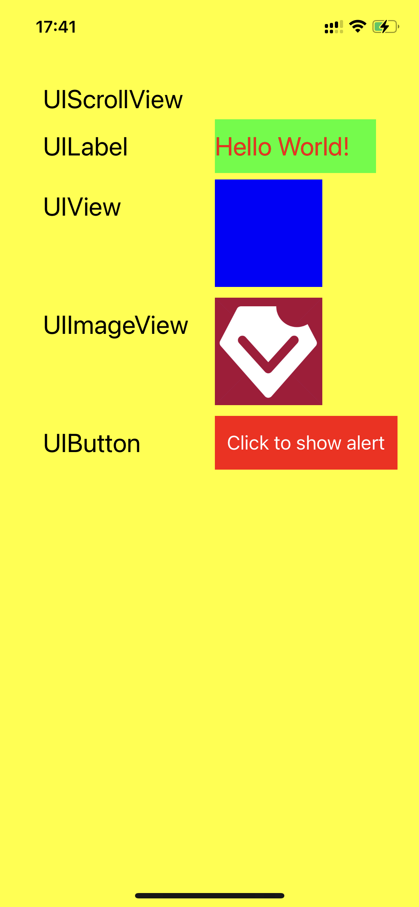

# iMRuby
iMRuby is an engine that acts as a  bridge between Objective-C and Ruby(Mruby)

## Demo


``` objective-c
// objective-c file
@interface MRBViewController ()

@property (nonatomic, strong) MRBContext *context;

@end

@implementation MRBViewController

- (void)viewDidLoad
{
    [super viewDidLoad];
    // 执行view.rb
    NSString *scriptPath = [[NSBundle mainBundle] pathForResource:@"view" ofType:@"rb"];
    NSString *script = [NSString stringWithContentsOfFile:scriptPath encoding:NSUTF8StringEncoding error:nil];
    self.context = [[MRBContext alloc] init];
    self.context.exceptionHandler = ^(NSError * _Nonnull exception) {
        NSLog(@"%@", exception.userInfo[@"msg"]);
    };
    
    [self.context registerConst:@"Target" value:self];
    [self.context evaluateScript:script];
    MRBValue *superView = [MRBValue valueWithObject:self.view inContext:self.context];
    [self.context callFunc:@"create_view" args:@[superView]];
    
}

- (void)touchAction:(id)sender
{
    [self.context evaluateScript:@"showAlertView"];
}

@end
```

``` ruby
# ruby file
require_cocoa "UIColor"
require_cocoa "UIView"
require_cocoa "UIImage"
require_cocoa "UIImageView"
require_cocoa "UILabel"
require_cocoa "UIFont"
require_cocoa "UIButton"
require_cocoa "UIAlertController"
require_cocoa "UIAlertAction"

def create_view(super_view)
    # Clolors
    red = UIColor.redColor
    blue = UIColor.blueColor
    green = UIColor.greenColor
    yellow = UIColor.yellowColor
    white = UIColor.whiteColor
    
    super_view.setBackgroundColor_(white)
    
    # UIlabel
    super_view.addSubview_(createLabel("UILabel", 40, 64))
    
    label = UILabel.alloc.init
    label.setFrame_({'x' => 200, 'y' => 64, 'width' => 150, 'height' => 50})
    label.setText_("Hello World!")
    label.setFont_(UIFont.systemFontOfSize_(24))
    label.setTextColor_(red)
    label.setBackgroundColor_(green)
    super_view.addSubview_(label)
    
    # UIView
    super_view.addSubview_(createLabel("UIView", 40, 120))
    
    blue_sub_view = UIView.alloc.init
    blue_sub_view.setFrame_({'x' => 200, 'y' => 120, 'width' => 100, 'height' => 100})
    blue_sub_view.setBackgroundColor_(blue)
    super_view.addSubview_(blue_sub_view)
    
    # UIImageView
    super_view.addSubview_(createLabel("UIImageView", 40, 230))
    
    image = UIImage.imageNamed_("logo")
    image_view = UIImageView.alloc.initWithImage_(image)
    image_view.setFrame_({'x'=>200, 'y'=> 230, 'width' => 100, 'height' => 100})
    super_view.addSubview_(image_view)
    
    # UIButton
    super_view.addSubview_(createLabel("UIButton", 40, 340))

    btn = UIButton.buttonWithType_(0)
    ## MRBCocoa::Const::Target is defined in OC
    ## [self.context registerConst:@"Target" value:self];
    ## “self” is the view controller
    ## "touchAction:" action is defined in OC and execute ruby script to show alert
    btn.addTarget_action_forControlEvents_(MRBCocoa::Const::Target, "touchAction:", 1<<6)
    btn.setTitle_forState_("Click to show alert", 0)
    btn.setFrame_({'x' => 200, 'y' => 340, 'width' => 170, 'height' => 50})
    btn.setBackgroundColor_(red)
    super_view.addSubview_(btn)
end

def showAlertView
    # UIAlertController
    completion = Proc.new {puts "show..."}
    completion_block = completion.to_cocoa_block("void,void")
    alertController = UIAlertController.alertControllerWithTitle_message_preferredStyle_("iMRuby", "Hello World!", 1)
    
    ok_handler = Proc.new {|action| puts "OK..."}
    ok_handler_block = ok_handler.to_cocoa_block("void, UIAlertAction")
    okAction = UIAlertAction.actionWithTitle_style_handler_("OK", 0, ok_handler_block)
    
    alertController.addAction_(okAction)
    
    MRBCocoa::Const::Target.presentViewController_animated_completion_(alertController, true, completion_block)
end

def createLabel(text, x, y)
    label = UILabel.alloc.init
    label.setFrame_({'x' => x, 'y' => y, 'width' => 150, 'height' => 50})
    label.setText_(text)
    label.setFont_(UIFont.systemFontOfSize_(24))
    label.setTextColor_(UIColor.blackColor)
    return label
end

```

## Installation

iMRuby is available through [CocoaPods](https://cocoapods.org). To install
it, simply add the following line to your Podfile:

```ruby
pod 'iMRuby'
```

## Class UML


## Usage
iMRuby usage is like JavascriptCore of iOS.
[aticle url](https://mp.weixin.qq.com/s?__biz=MzkxMjAxNDI1MQ==&mid=2247483661&idx=1&sn=f20222c330af17a27d203e913073f710&chksm=c1122fc9f665a6dfb0fa720535e59257fe640b4c4abe4f324eaeca38919f6b2cf2ea68ce5e62&token=658452920&lang=zh_CN#rd)

Ruby and OC are converted to each other
|  OC type   | Ruby type  |
|  ----  | ----  |
| nil | nil |
| NSString  | string, symbol |
| NSNumber  | Fixnum, Float, boolean |
| NSDictionary  | Hash |
| NSArray  | Array |
| NSDate  | Time |
| NSBlock  | Wrapper object ruby class MRBCocoa::Block |
| id/NSObject  |  Wrapper object ruby class MRBCocoa::Object |
| class  | Wrapper object ruby class MRBCocoa::Klass |
| CGPoint  | specific Hash {'x' => 1, 'y' => 1} |
| CGSize  | specific Hash {'width' => 1, 'height' => 1} |
| CGRect  |  specific Hash {'x' => 1, 'y' => 1, 'width' => 1, 'height' => 1}|
| NSRange  | specific Hash {'location' => 0, 'length' => 1} |

#### create `MRBContext` instance
``` objective-c
self.context = [[MRBContext alloc] init];
```

#### run ruby script
``` objective-c
[self.context evaluateScript:@"puts \"Happy Niu year!\""];
# => Happy Niu year!
```

#### catch exception
``` objective-c
self.context.exceptionHandler = ^(NSError * _Nonnull exception) {
        NSLog(@"%@", exception.userInfo[@"msg"]);
    };
[self.context evaluateScript:@"happy_nui_year(2021)"];
# => undefined method 'happy_niu_year' (NOMethodError)
```

#### register constant
``` objective-c
[self.context registerConst:@"Niu" value:@"Happy Niu year!"];
[self.context evaluateScript:@"puts MRBCocoa::Const::Niu"];
# => Happy Niu year!
```

#### register method
``` objective-c
[self.context registerFunc:@"happy_niu_year" block:^NSInteger(int a, int b){
    NSLog(@"start...");
    int sum = a + b;
    NSLog(@"finish...");
    return sum;
 }];
 MRBValue *sum = [self.context evaluateScript:@"MRBCocoa.happy_niu_year(2020,1)"];
 NSInteger niu_year = sum.toInt64;
 NSLog(@"%@", @(niu_year));
# => start...
# => finish...
# => 2021
```

#### register method or constant by subscript
``` objective-c
self.context[@"Niu"] = @"Happy Niu year!";
self.context[@"happy_niu_year"] = ^NSInteger(int a, int b) {
     NSLog(@"start...");
     int sum = a + b;
     NSLog(@"finish...");
    return sum;
};
MRBValue *sum = [self.context evaluateScript:@"puts MRBCocoa::Const::Niu;MRBCocoa.happy_niu_year(2020,1)"];
NSInteger niu_year = sum.toInt64;
NSLog(@"%@", @(niu_year));
```

#### OC invoke ruby method
```ruby
# ruby.rb
def test_func(str)
    puts str
end
```
```objective-c
    MRBValue *strParam = [MRBValue valueWithString:@"hello" inContext:self.context];
    [self.context callFunc:@"test_func" args:@[strParam]];
```

#### ruby invoke OC object method
``` objective-c
// OC .m file
@interface Person : NSObject
@property (nonatomic, copy) NSString *name;
@property (nonatomic, assign) int age;
- (NSString *)say_something:(NSString *)message;
- (void)coding:(NSString *)code finished:(BOOL(^)(NSString *name, int age))finished;
@end
@implementation Person
- (NSString *)say_something:(NSString *)message
{
    NSLog(@"%@", message);
    return [self.name stringByAppendingString:message];
}
- (void)coding:(NSString *)code finished:(BOOL(^)(NSString *name, int age))finished
{
    NSLog(@"I am coding %@", code);
    if (finished) {
        BOOL f = finished(self.name, self.age);
        NSLog(@"Block return value: %@", @(f));
    }
}
@end
```
``` ruby
# ruby .rb file
require_cocoa 'Person'

person = Person.alloc.init
person.setName_('anan')
person.setAge_(2)
message = person.say__something_("happy Niu year!")
puts message

finished = Proc.new {|name, age| puts "I am #{name}, #{age} year old"; true}
finished_block = finished.to_cocoa_block("BOOL, NSString *, int");
person.coding_finished_("Ruby", finished_block)

```

#### invoke OC method rules:  
1. replace ':' with '_'
```
- (NSString *)saySomething:(NSString *)message;
message = person.saySomething_("happy Niu year!")
```

2. replace '_' with '__'
```
- (NSString *)say_something:(NSString *)message;
message = person.say__something_("happy Niu year!")
```

3. if '_' or '__' is in the head of oc mehtod name, do nothing
```
- (NSString *)__say_something:(NSString *)message;
message = person.__say__something_("happy Niu year!")
```
4. if oc method has a NSBlock parameter, can use `to_cocoa_block` to convert `Proc` to `NSBlock`
```
- (void)coding:(NSString *)code finished:(BOOL(^)(NSString *name, int age))finished;

// ruby
finished = Proc.new {|name, age| puts "I am #{name}, #{age} year old"; true}
finished_block = finished.to_cocoa_block("BOOL, NSString *, int");
person.coding_finished_("Ruby", finished_block)
```

## Notice
If you run the example on a simulator on Apple silicon(M1),You need try to add arm64 to the Build Settings -> Architectures -> Excluded Architectures for Any iOS Simulator SDK. 


## Author

ping.cao

## License

iMRuby is available under the MIT license. See the LICENSE file for more info.
